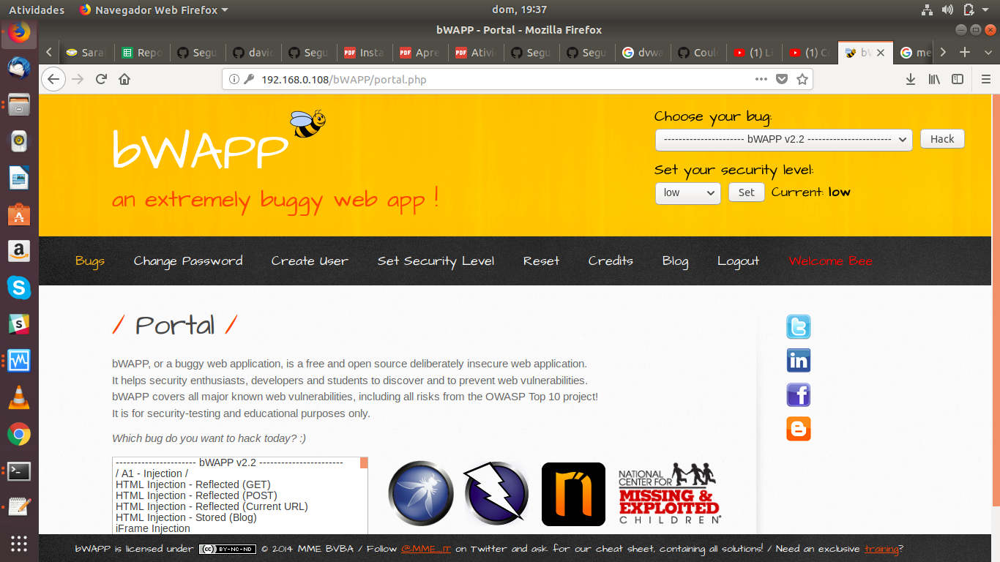

# Atividade File Inclusion

A atividade foi realizada como proposta, todos os passos foram seguidos e as imagens seguem junto a este arquivo de texto, tanto a configuração do bWAPP quando do b374k, responsavel por gerar o arquivo que é incluido no servidor a ser atacado foram realizadas, porém para configurar o bWAPP foi um pouco complexo.

