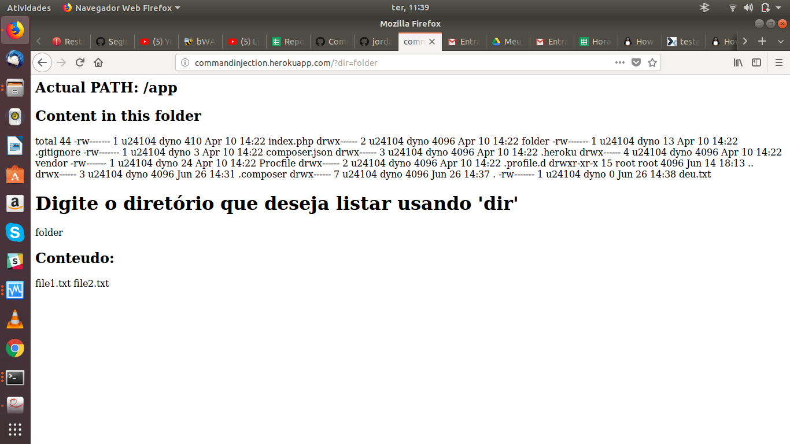
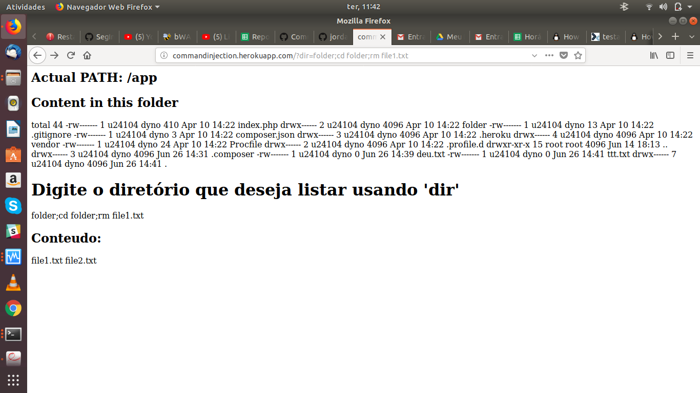
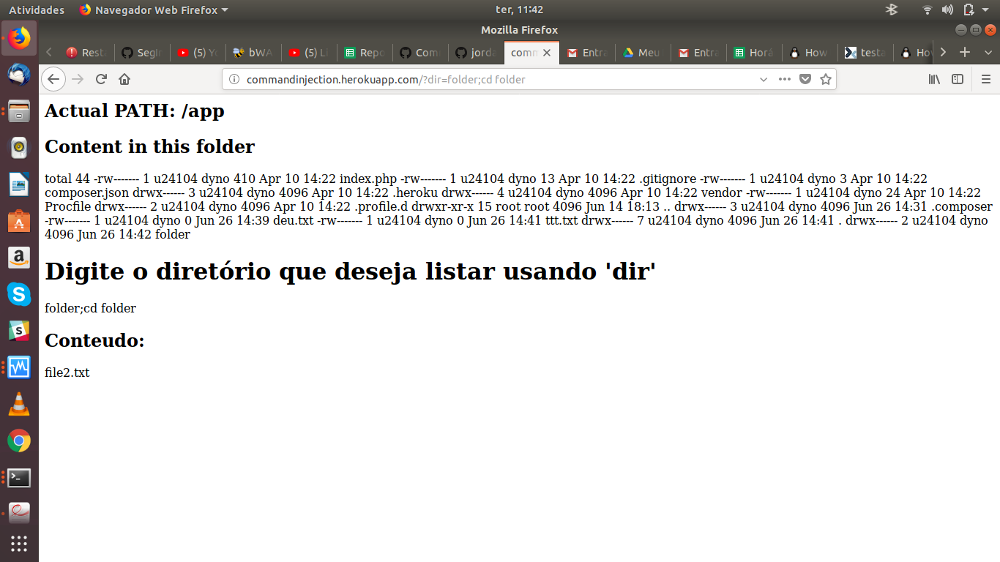
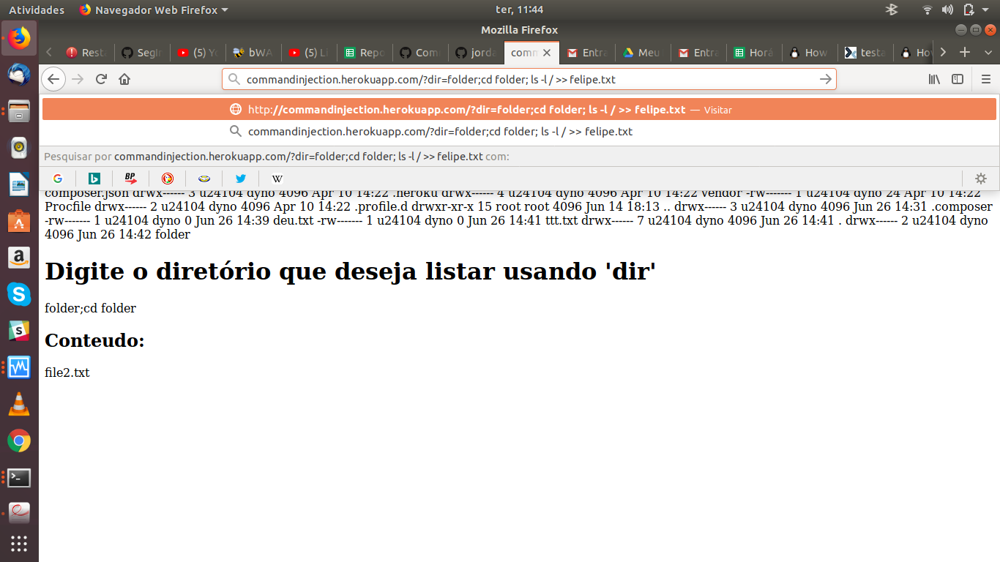
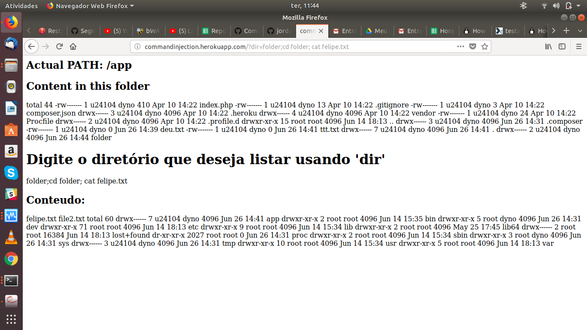

# Atividade Command Injection

A atividade foi realizada como proposta, um conteúdo interessante, não houve grandes problemas para a realização. Concluida as duas partes, segue prints da execução dos comandos.

