# Atividade Invasão Wifi

Atividade realizada como proposta, segue prints das telas de execução e os arquivos gerados durante a prática, apesar de ter varios passos de execução, o uso é simples e não apresentou grande dificuldade. A captura de tela final, esta mostrando o processo incompleto, por se tratar de uma rede real, pois não consegui um roteador para realizar a prática, porém funciona, mesmo que aplicando a vida real, isso seja bem dificil de se conseguir, já que normalmente as senhas tem padrões bem dificeis de se decifrar e o teste de chave a chave pode demorar muito.

Um pequeno problema que percebi no tutorial, na versão do ubuntu, foi a indicação da instalação do crunch no meio do processo, já que neste ponto não conseguimos nos conectar a nada pois o aircrack mata o NetworkManager.

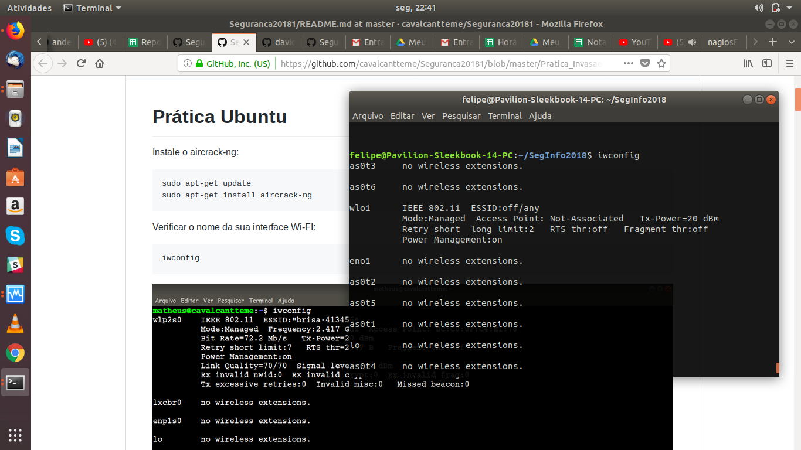
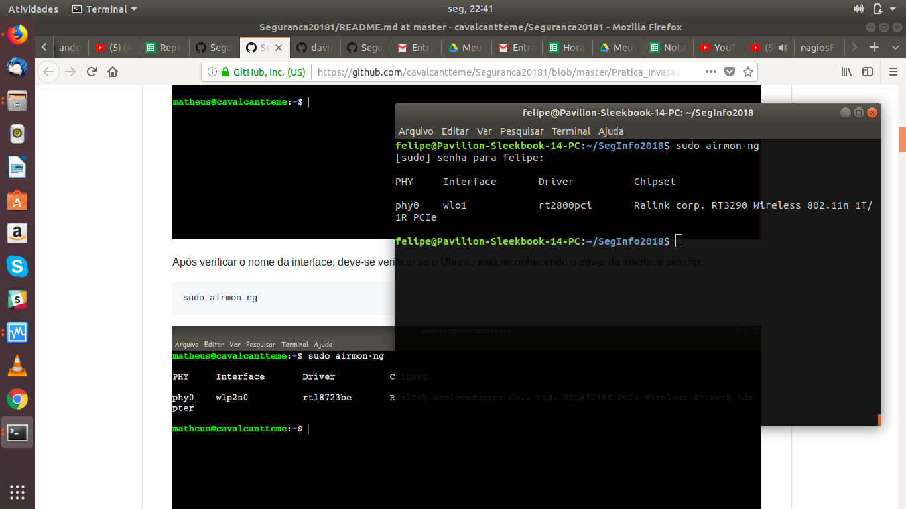
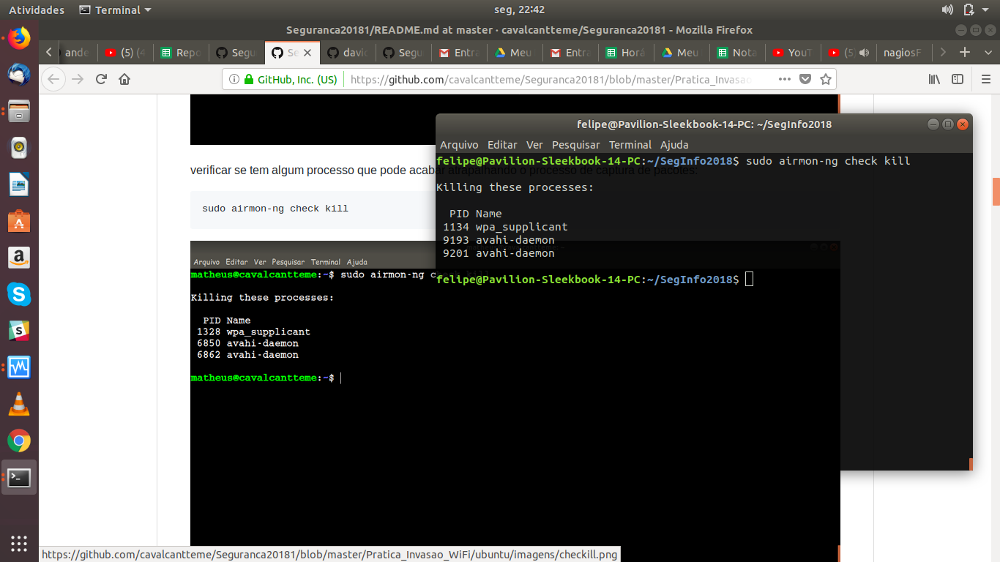
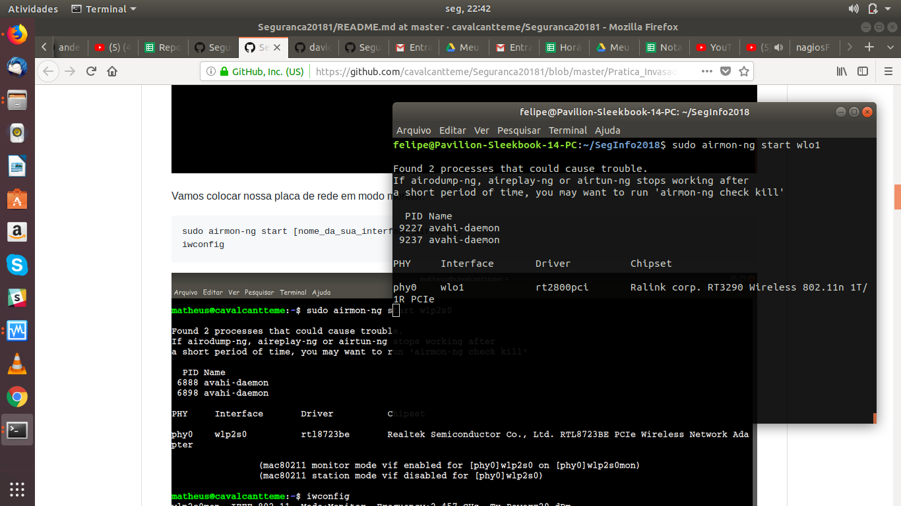
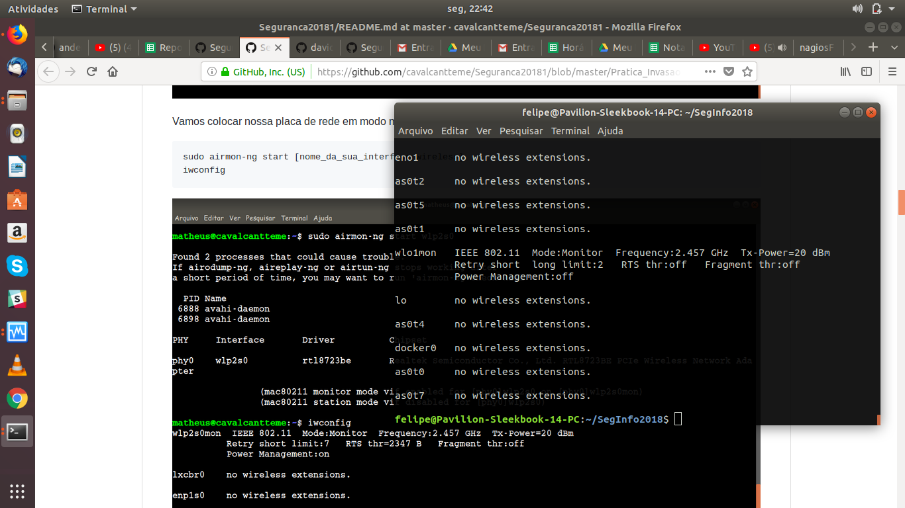
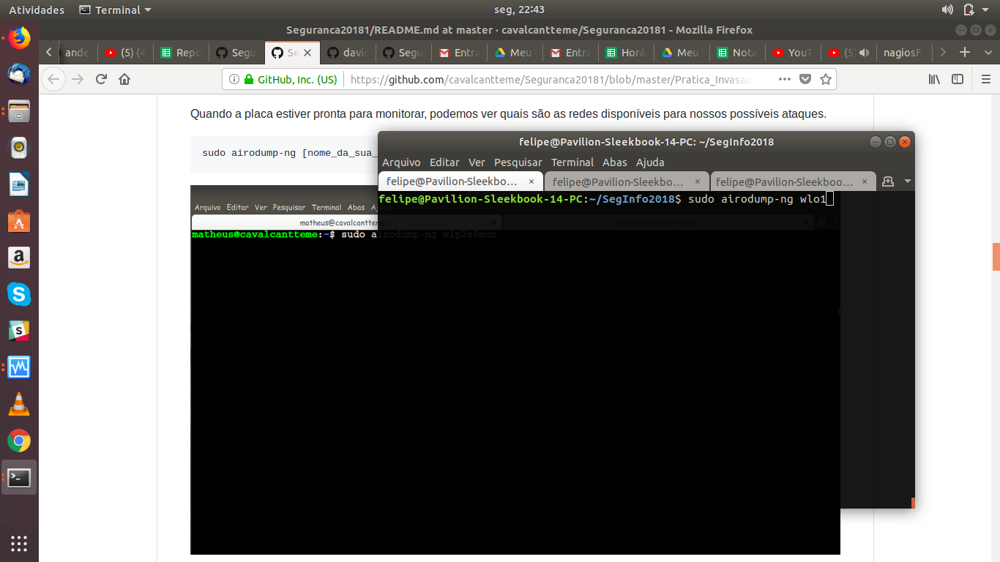
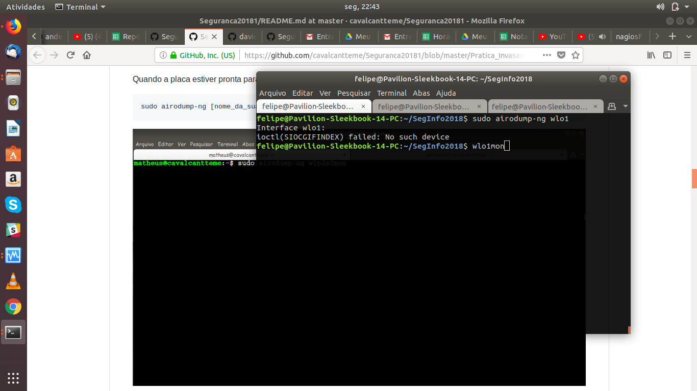
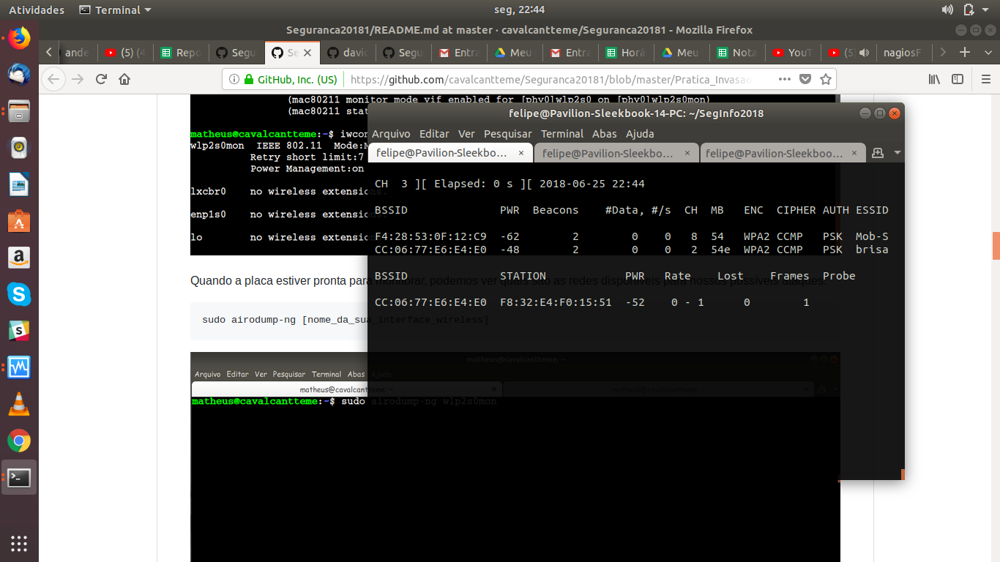
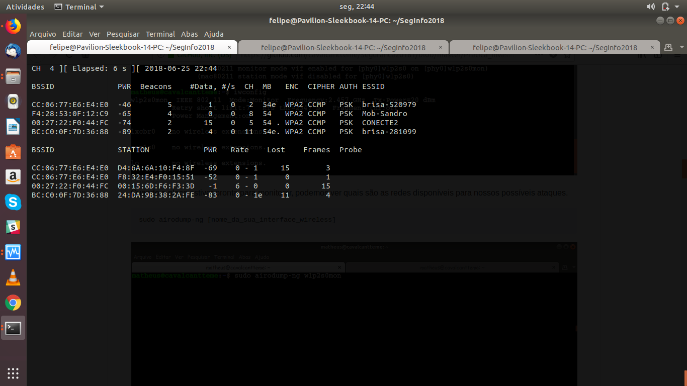
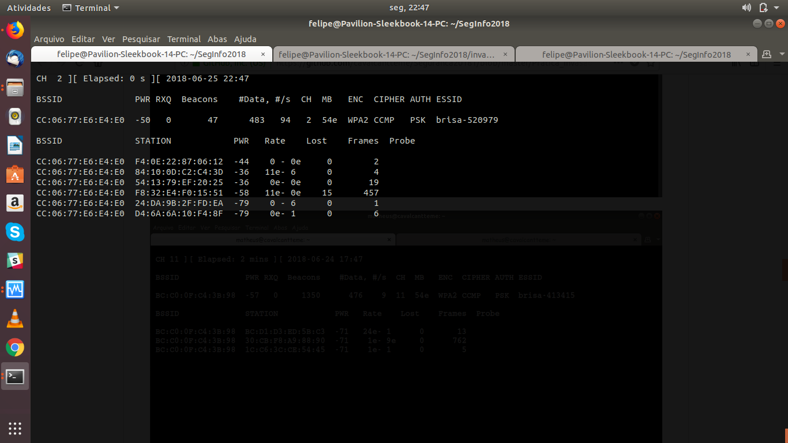
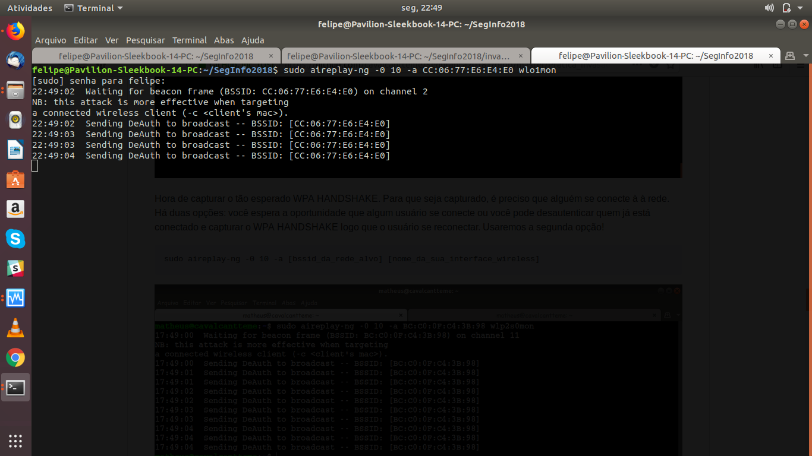
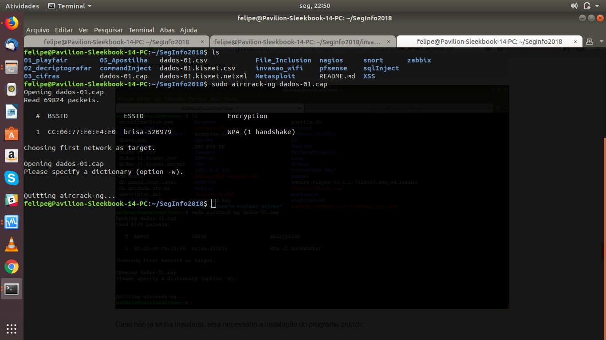
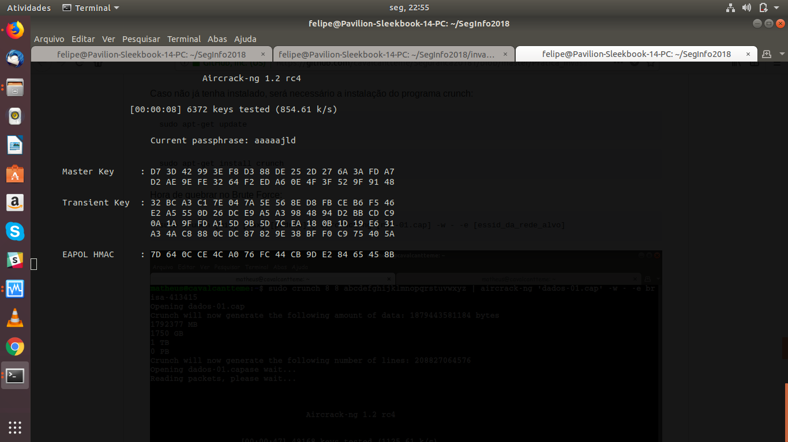

