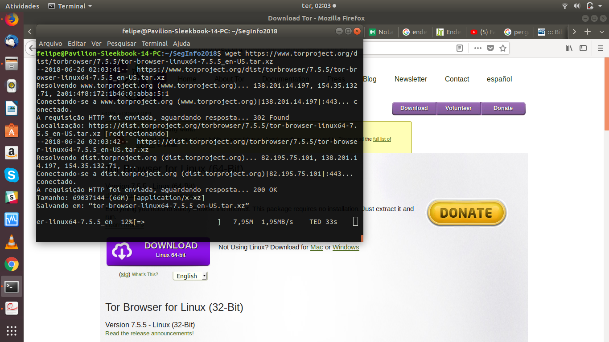
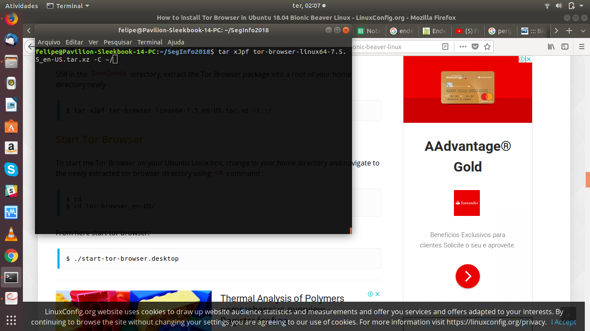
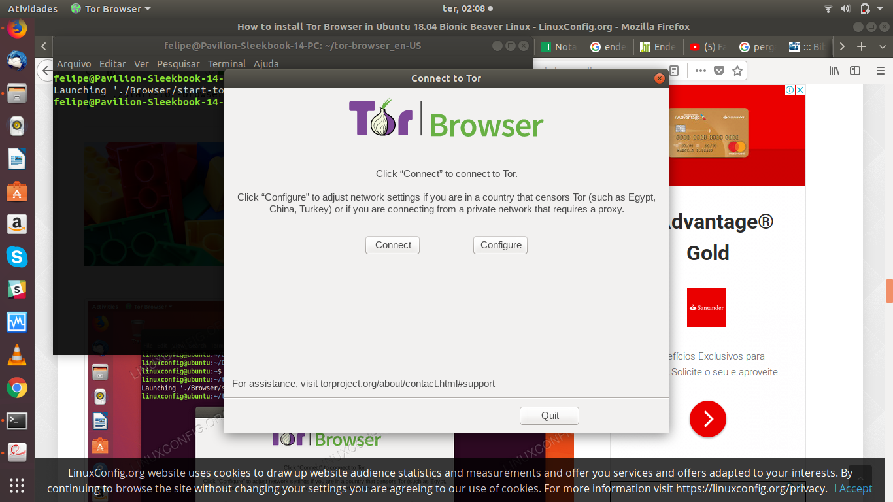
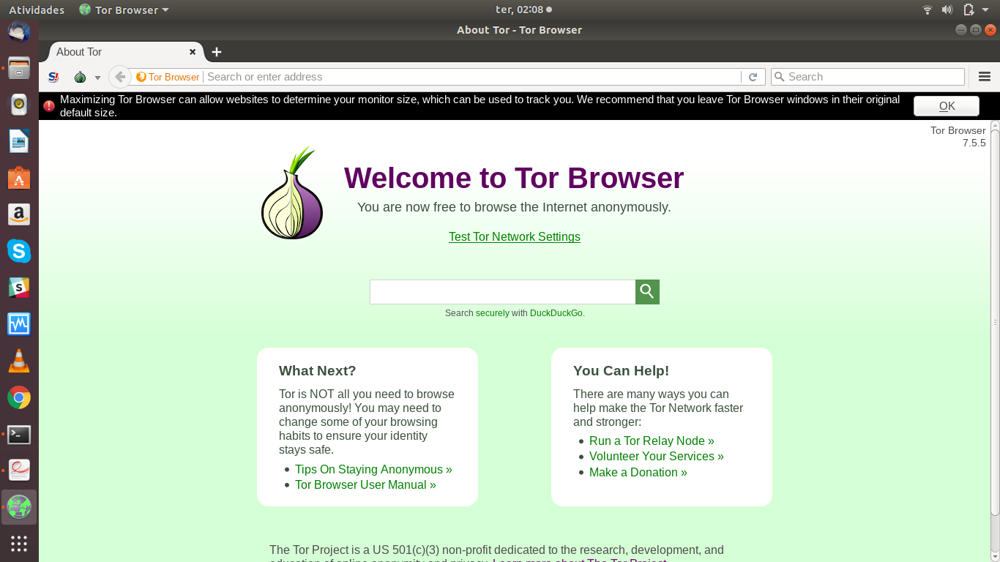
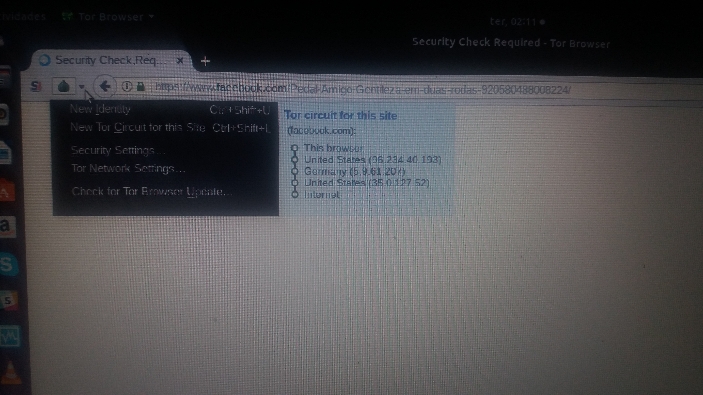
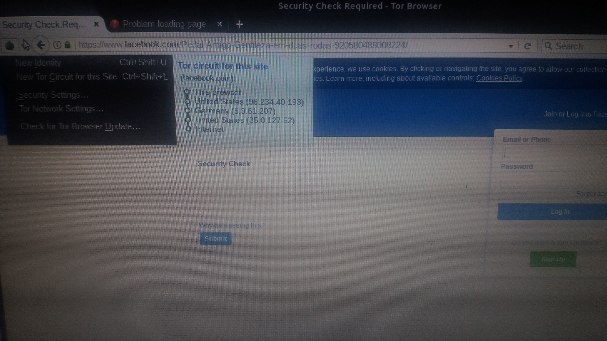

# Atividade Tor

Como tive alguns problemas com o tutorial, decidi por instalar o tor utilizando alguns tutoriais, na internet.

1. Download do pacote

```
wget https://www.torproject.org/dist/torbrowser/7.5.5/tor-browser-linux64-7.5.5_en-US.tar.xz
```


2. Descompactar o arquivo recebido

```
tar xJpf tor-browser-linux64-7.5.5_en-US.tar.xz -C ~/
```



3. Entrar na pasta decompactada e executar o tor-browser.desktop
```
cd ~/tor-browser_en-US

./start-tor-browser.desktop

```



4. Com o navegador ja aberto basta colocar um site para ser acessado na barra de URI



5. No exemplo testei o acesso ao facebook, e o mesmo me mostrou este caminho de acesso





Somente realizei o acesso ao tor browser e acessei o utilizando, passando por varios paises para concluir o acesso.

# Referência

https://linuxconfig.org/how-to-install-tor-browser-in-ubuntu-18-04-bionic-beaver-linux
